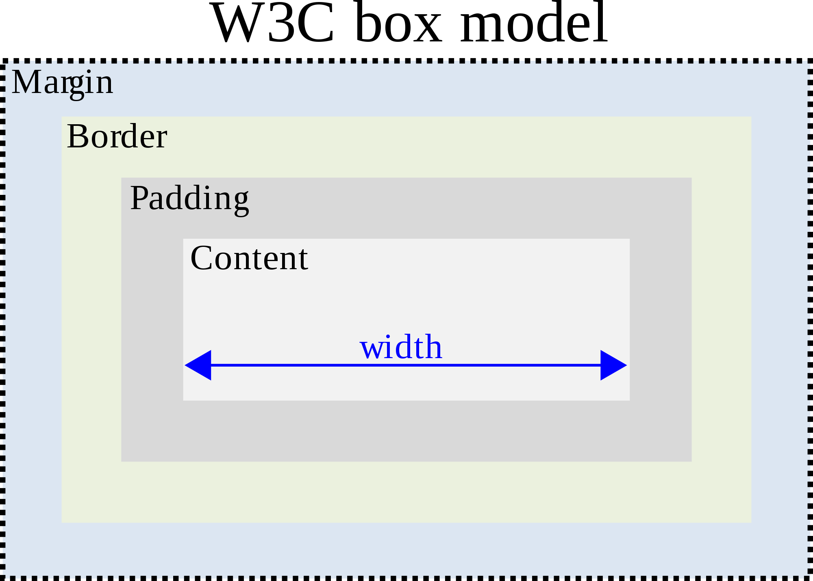

:::: {.slide}


## Crash Course: Build a Web Page

Wifi: TIY-Turing

Password: TIYturing16

::::

## What Makes a Web Page?

* HTML: the content of the page
* CSS: directions on how to style the page
* JS: code to make the page interactive

## View Source

In Chrome: View > Developer > View Source

See the HTML that makes up any page.

---

```html
<html>
<head>
  <title>Momentum Learning</title>
</head>

<body>
    <h1>Momentum Learning</h1>
    <h2>Knowledge doesn't have a finish line</h2>
    <p>
        We provide personalized training for companies as well as
        immersive courses for individuals in software development.
        We are a lifelong learning community that supports our alumni
        throughout their career journeys. We welcome students from
        all walks of life and value the power of a multi-generational,
        diverse, inclusive classroom.
    </p>
</body>
</html>
```


## Before we start

Go to https://thimble.mozilla.org/. Sign up. We'll use this to demonstrate.


## HTML Tags

* Always in angle brackets
* _Usually_ have an opening and closing bracket, like `<h1>Title</h1>`
* Nested inside each other, making a tree of _nodes_ or _elements_


## Structural tags

```html
<!-- Required to let the browser know the version of HTML -->
<!DOCTYPE html>  
<!-- Starts the document, always the first tag -->
<html>           
<!-- Contains info like the title, language, and styles -->
<head>
    <title>My HTML page</title>
</head>    
<!-- Contains the main content -->
<body></body>    
<!-- Closes the document -->
</html>          
```


## Block tags

* h1, h2, h3, h4, h5, h6
* ul, ol, li
* p
* section
* article
* div


## Headers

```html
<h1>The biggest header</h1>
<h2>Great for section headings</h2>
<h3>Good for subsection headings</h3>
<h4>Wow, this must be a very nested document</h4>
<h5>Why you would have this many headings?</h5>
<h6>The smallest header</h6>
```


## Lists

```html
<ul> <!-- unordered list -->
    <li>2 cups oatmeal</li>
    <li>2 cups milk</li>
    <li>2 eggs</li>
</ul>

<ol> <!-- ordered list -->
    <li>Pour the oatmeal into a bowl</li>
    <li>Add the milk</li>
    <li>Add two eggs and mix well</li>
</ol>
```


## Paragraphs

```html
<p>
    Each paragraph goes inside a paragraph tag.
</p>
<p>
    Paragraph tags normally show up next to each other.
</p>
```


## Content grouping tags

```html
<section>
    Useful for different sections of your document, like
    an introduction or the main content. Usually has a heading.
</section>
<article>
    There are some more specific tags. Besides article, there is
    also header, footer, aside, and nav.
</article>
<div>
    A generic grouping tag. Used often to style content.
</div>
```


## Text tags

* strong
* em
* a
* span


## strong and em

```html
<p>
    You might use strong when you <strong>really</strong>
    mean it, and you might use em for <em>emphasis</em>,
    or for foreign words or book titles.
</p>
```


## Links

The `<a>` tag is used for links. It has a _tag attribute_ to specify where the link goes to.

```html
<a href="https://twitter.com/momentumrdu">
    Momentum Learning
</a>
```


## Tag attributes

All tags can have tag attributes. A tag attribute has the attribute name on the left side, an equals sign, and a value in quotation marks on the right.

* `href` is used in links. It stands for "hypertext reference."
* `class` can be used on all tags and helps with styling.
* `id` can be used on all tags and should be unique within the document.


## The image tag

The image tag allows us to insert an image into a document. The `src` attribute points to the source of the image and the `alt` attribute provides a text description of the image for the visually impaired.

```html

```


## Adding CSS

Use a `link` tag in the `head` of your document to add a stylesheet.

```html
<head>
    <link rel="stylesheet" href="style.css">
</head>
```


## CSS


## CSS selectors

We can apply styles to a particular part of our HTML document using _selectors_.

* `h1` - selects all `h1` elements
* `h1, h2` - selects all `h1` and `h2` elements
* `.selfie` - selects all elements with the class "selfie"
* `.sidebar a` - selects all `a` elements nested inside elements with the class "sidebar"


## CSS properties

We use _properties_ to set the style of selected elements.

```css
.selfie {
  border-color: black;
  border-width: 1px;
  border-style: solid;
  padding: 3px;
}
```

Notice the semicolons at the end of each line.


## CSS syntax

```css
selector {
    property: value;
}
```

Always start with a selector, then curly braces. You can have multiple property-value pairs inside the braces. You cannot nest braces.


## Text and font properties

* color: the color of the text, by name or hex code
* font-size: the size of the text, in pixels (px) or em-units
* font-family: the font used, multiples can be listed
* font-weight: normal, bold
* text-decoration: none, underline, overline, line-through, blink
* text-align: left, right, center, justify


## Colors

There is a giant list of color names you can use, but people generally use a _hex code_. A hex code is a set of three numbers between 0 and 255 in hexadecimal (base-16) format, beginning with a pound sign, like: `#FF00A7`.

The first number is the amount of red, the second the amount of green, and the third the amount of blue. `#000000` is black and `#FFFFFF` is white.

See [HTML Color Codes](http://htmlcolorcodes.com/).


## Block properties

* background-color
* padding: space inside the box
* margin: space outside the box
* border-width: size of the border
* border-color: color of the border
* border-style: none, dotted, dashed, solid, double
* border-radius: round corners
* width: total width of box, in px, em, or percentage


## Box model




## margin and padding

You can specify the margin and padding in three ways:

* one margin for all sides
* one margin for the top and bottom and another for the sides
* one margin for each side in this order: top, right, bottom, left (clockwise)

---

```css
margin: 5px;                /* all */
margin: 5px 10px:           /* vertical, horizontal */
margin: 5px 10px 10px 20px; /* top, right, bottom, left */
```


## Units of measure

* px - pixels, not an absolute measure, dependent on device
* em - relative to the font-size, 1em = 1 x font-size, additive
* rem - relative to the base font-size, not additive
* % - percentage, relative to enclosing element


## A box with rounded corners and a border

```css
.likes {
  background-color: blue;
  border-color: black;
  border-radius: 10px;
  border-style: solid;
  border-width: 1px;
  color: white;
  margin: 10px 0;
  padding: 5px 10px;
}
```


## Practical exercise

We are going to make a personal web page with:

* your name
* a picture
* a list of your interests
* a Twitter-style set of posts
* whatever else you like!

It should use multiple colors and font sizes.
